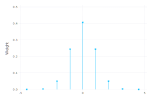
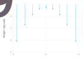
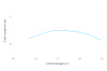
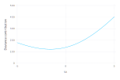
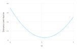
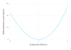
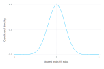
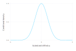
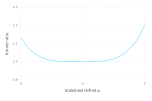

# Normalized Gauss-Hermite Quadrature

[*Gaussian Quadrature rules*](https://en.wikipedia.org/wiki/Gaussian_quadrature) provide sets of `x` values, called *abscissae*, and weights, `w`, to approximate an integral with respect to a *weight function*, $g(x)$.
For a `k`th order rule the approximation is
```math
\int f(x)g(x)\,dx \approx \sum_{i=1}^k w_i f(x_i)
```

For the *Gauss-Hermite* rule the weight function is
```math
g(x) = e^{-x^2}
```

and the domain of integration is $(-\infty, \infty)$.
A slight variation of this is the *normalized Gauss-Hermite* rule for which the weight function is the standard normal density
```math
g(z) = \phi(z) = \frac{e^{-z^2/2}}{\sqrt{2\pi}}
```

Thus, the expected value of $f(z)$, where $\mathcal{Z}\sim\mathscr{N}(0,1)$, is approximated as
```math
\mathbb{E}[f]=\int_{-\infty}^{\infty} f(z) \phi(z)\,dz\approx\sum_{i=1}^k w_i\,f(z_i) .
```

Naturally, there is a caveat. For the approximation to be accurate the function $f(z)$ must behave like a low-order polynomial over the range of interest.
More formally, a `k`th order rule is exact when `f` is a `k-1` order polynomial.

## Evaluating the weights and abscissae

In the [*Golub-Welsch algorithm*](https://en.wikipedia.org/wiki/Gaussian_quadrature#The_Golub-Welsch_algorithm) the abscissae for a particular Gaussian quadrature rule are determined as the eigenvalues of a symmetric tri-diagonal matrix and the weights are derived from the squares of the first row of the matrix of eigenvectors.
For a `k`th order normalized Gauss-Hermite rule the tridiagonal matrix has zeros on the diagonal and the square roots of `1:k-1` on the super- and sub-diagonal, e.g.
````julia
julia> using LinearAlgebra, Gadfly

julia> sym3 = SymTridiagonal(zeros(3), sqrt.(1:2))
3×3 LinearAlgebra.SymTridiagonal{Float64,Array{Float64,1}}:
 0.0  1.0       ⋅     
 1.0  0.0      1.41421
  ⋅   1.41421  0.0    

julia> ev = eigen(sym3);

julia> show(ev.values)
[-1.73205, 1.11022e-15, 1.73205]
julia> show(abs2.(ev.vectors[1,:]))
[0.166667, 0.666667, 0.166667]
````


As a function of `k` this can be written as
````julia
function gausshermitenorm(k)
    ev = eigen(SymTridiagonal(zeros(k), sqrt.(1:k-1)))
    ev.values, abs2.(ev.vectors[1,:])
end
````


providing
````julia
julia> gausshermitenorm(3)
([-1.73205, 1.11022e-15, 1.73205], [0.166667, 0.666667, 0.166667])

````


The weights and positions are often shown as a *lollipop plot*.
For the 9th order rule these are



Notice that the magnitudes of the weights drop quite dramatically away from zero, even on a logarithmic scale



The definition of `MixedModels.GHnorm` is similar to the `gausshermitenorm` function with some extra provisions for ensuring symmetry of the abscissae and the weights and for caching values once they have been calculated.
```@docs
GHnorm
```
````julia
julia> using MixedModels

julia> GHnorm(3)
MixedModels.GaussHermiteNormalized{3}([-1.73205, 0.0, 1.73205], [0.166667, 0.666667, 0.166667])

````


By the properties of the normal distribution, when $\mathcal{X}\sim\mathscr{N}(\mu, \sigma^2)$
```math
\mathbb{E}[g(x)] \approx \sum_{i=1}^k g(\mu + \sigma z_i)\,w_i
```

For example, $\mathbb{E}[\mathcal{X}^2]$ where $\mathcal{X}\sim\mathcal{N}(2, 3^2)$ is

````julia
julia> μ = 2; σ = 3; ghn3 = GHnorm(3);

julia> sum(@. ghn3.w * abs2(μ + σ * ghn3.z))  # should be μ² + σ² = 13
13.0

````


(In general a dot, '`.`', after the function name in a function call, as in `abs2.(...)`, or before an operator creates a [*fused vectorized*](https://docs.julialang.org/en/stable/manual/performance-tips/#More-dots:-Fuse-vectorized-operations-1) evaluation in Julia.
The macro `@.` has the effect of vectorizing all operations in the subsequent expression.)

## Application to a model for contraception use

A *binary response* is a "Yes"/"No" type of answer.
For example, in a 1989 fertility survey of women in Bangladesh (reported in [Huq, N. M. and Cleland, J., 1990](https://www.popline.org/node/371841)) one response of interest was whether the woman used artificial contraception.
Several covariates were recorded including the woman's age (centered at the mean), the number of live children the woman has had (in 4 categories: 0, 1, 2, and 3 or more), whether she lived in an urban setting, and the district in which she lived.
The version of the data used here is that used in review of multilevel modeling software conducted by the Center for Multilevel Modelling, currently at University of Bristol (http://www.bristol.ac.uk/cmm/learning/mmsoftware/data-rev.html).
These data are available as the `Contraception` data frame in the test data for the `MixedModels` package.
````julia
julia> using DataFrames, DataFramesMeta, RData

julia> const dat = Dict(Symbol(k)=>v for (k,v) in 
    load(joinpath(dirname(pathof(MixedModels)), "..", "test", "dat.rda")));

julia> const contra = @transform(dat[:Contraception],
     a2 = abs2.(:a), urbdist = string.(:urb, :d));

julia> describe(contra)
8×8 DataFrames.DataFrame. Omitted printing of 2 columns
│ Row │ variable │ mean       │ min    │ median  │ max     │ nunique │
│     │ Symbol   │ Union…     │ Any    │ Union…  │ Any     │ Union…  │
├─────┼──────────┼────────────┼────────┼─────────┼─────────┼─────────┤
│ 1   │ w        │            │ 1      │         │ 1934    │ 1934    │
│ 2   │ d        │            │ 1      │         │ 61      │ 60      │
│ 3   │ use      │            │ N      │         │ Y       │ 2       │
│ 4   │ l        │            │ 0      │         │ 3+      │ 4       │
│ 5   │ a        │ 0.00219788 │ -13.56 │ -1.5599 │ 19.44   │         │
│ 6   │ urb      │            │ N      │         │ Y       │ 2       │
│ 7   │ a2       │ 81.1966    │ 0.1936 │ 55.3536 │ 377.914 │         │
│ 8   │ urbdist  │            │ N1     │         │ Y9      │ 102     │

````


Because a smoothed scatterplot of contraception use versus age



shows that the proportion of women using artificial contraception is approximately quadratic in age,
a column named `:a2`, which is the square of the age, `:a`, is added to the data frame using the `@transform` macro.

A model with fixed-effects for age, age squared, number of live children and urban location and with random effects for district, is fit as
````julia
julia> const form1 = @formula use ~ 1 + a + a2 + l + urb + (1|d);

julia> m1 = fit!(GeneralizedLinearMixedModel(form1, contra,
    Bernoulli()), fast=true)
Generalized Linear Mixed Model fit by maximum likelihood (nAGQ = 1)
  Formula: use ~ 1 + a + a2 + l + urb + (1 | d)
  Distribution: Distributions.Bernoulli{Float64}
  Link: GLM.LogitLink()

  Deviance: 2372.7844

Variance components:
       Column    Variance   Std.Dev.  
 d (Intercept)  0.22532962 0.47468897

 Number of obs: 1934; levels of grouping factors: 60

Fixed-effects parameters:
               Estimate   Std.Error  z value P(>|z|)
(Intercept)    -1.01528    0.173972 -5.83585   <1e-8
a            0.00351346  0.00921057 0.381459  0.7029
a2           -0.0044867 0.000722835 -6.20708   <1e-9
l: 1           0.801881    0.161867  4.95396   <1e-6
l: 2           0.901017    0.184771   4.8764   <1e-5
l: 3+          0.899412    0.185401  4.85118   <1e-5
urb: Y         0.684401    0.119684   5.7184   <1e-7


````


For a model such as `m1`, which has a single, scalar random-effects term, the unscaled conditional density of the spherical random effects variable, $\mathcal{U}$,
given the observed data, $\mathcal{Y}=\mathbf{y}_0$, can be expressed as a product of scalar density functions, $f_i(u_i),\; i=1,\dots,q$.
In the PIRLS algorithm, which determines the conditional mode vector, $\tilde{\mathbf{u}}$, the optimization is performed on the *deviance scale*, 
```math
D(\mathbf{u})=-2\sum_{i=1}^q \log(f_i(u_i))
```
The objective, $D$, consists of two parts: the sum of the (squared) *deviance residuals*, measuring fidelity to the data, and the squared length of $\mathbf{u}$, which is the penalty.
In the PIRLS algorithm, only the sum of these components is needed.
To use Gauss-Hermite quadrature the contributions of each of the $u_i,\;i=1,\dots,q$ should be separately evaluated.
````julia
julia> const devc0 = map!(abs2, m1.devc0, m1.u[1]);  # start with uᵢ²

julia> const devresid = m1.resp.devresid;   # n-dimensional vector of deviance residuals

julia> const refs = m1.LMM.trms[1].refs;  # n-dimensional vector of indices in 1:q

julia> for (dr, i) in zip(devresid, refs)
    devc0[i] += dr
end

julia> show(devc0)
[121.293, 22.0226, 2.91895, 30.7877, 47.5419, 69.5551, 23.4047, 46.279, 24.4528, 7.75949, 9.77364, 42.7589, 27.5526, 156.421, 26.1925, 27.4161, 24.5381, 57.5662, 31.1792, 22.3417, 27.478, 19.9885, 16.0108, 9.76147, 83.8633, 15.5687, 42.7598, 51.4686, 32.7332, 70.4157, 39.686, 27.544, 14.6975, 53.0474, 64.8499, 19.7439, 19.4156, 11.2423, 37.4169, 54.2651, 39.5826, 17.3984, 60.2275, 28.8192, 42.4441, 112.992, 17.2977, 51.5772, 2.18724, 22.9614, 47.4145, 87.2315, 25.9235, 9.47034, 61.1762, 27.1028, 48.0163, 8.46023, 30.3652, 47.3741]
````


One thing to notice is that, even on the deviance scale, the contributions of different districts can be different magnitudes.
This is primarily due to different sample sizes in the different districts.
````julia
julia> using FreqTables

julia> freqtable(contra, :d)'
1×60 Named LinearAlgebra.Adjoint{Int64,Array{Int64,1}}
' ╲ d │   1    2    3    4    5    6    7  …   55   56   57   58   59   60   61
──────┼────────────────────────────────────────────────────────────────────────
1     │ 117   20    2   30   39   65   18  …    6   45   27   33   10   32   42

````


Because the first district has one of the largest sample sizes and the third district has the smallest sample size, these two will be used for illustration.
For a range of $u$ values, evaluate the individual components of the deviance and store them in a matrix.
````julia
const devc = m1.devc
const xvals = -5.0:2.0^(-4):5.0
const uv = vec(m1.u[1])
const u₀ = vec(m1.u₀[1])
results = zeros(length(devc0), length(xvals))
for (j, u) in enumerate(xvals)
    fill!(devc, abs2(u))
    fill!(uv, u)
    MixedModels.updateη!(m1)
    for (dr, i) in zip(devresid, refs)
        devc[i] += dr
    end
    copyto!(view(results, :, j), devc)
end
````


A plot of the deviance contribution versus $u_1$



shows that the deviance contribution is very close to a quadratic.
This is also true for $u_3$



The PIRLS algorithm provides the locations of the minima of these scalar functions, stored as 
````julia
julia> m1.u₀[1]
1×60 Array{Float64,2}:
 -1.58477  -0.0727333  0.449062  0.341585  …  -0.767064  -0.90292  -1.06624

````


the minima themselves, evaluated as `devc0` above, and a horizontal scale, which is the inverse of diagonal of the Cholesky factor.
As shown below, this is an estimate of the conditional standard deviations of the components of $\mathcal{U}$.
````julia
julia> const s = inv.(m1.LMM.L.data[Block(1,1)].diag);

julia> s'
1×60 LinearAlgebra.Adjoint{Float64,Array{Float64,1}}:
 0.406889  0.713511  0.952164  0.627135  …  0.839679  0.654965  0.60326

````


The curves can be put on a common scale, corresponding to the standard normal, as
````julia
for (j, z) in enumerate(xvals)
    @. uv = u₀ + z * s
    MixedModels.updateη!(m1)
    @. devc = abs2(uv) - devc0
    for (dr, i) in zip(devresid, refs)
        devc[i] += dr
    end
    copyto!(view(results, :, j), devc)
end
````





On the original density scale these become
````julia
for (j, z) in enumerate(xvals)
    @. uv = u₀ + z * s
    MixedModels.updateη!(m1)
    @. devc = abs2(uv) - devc0
    for (dr, i) in zip(devresid, refs)
        devc[i] += dr
    end
    copyto!(view(results, :, j), @. exp(-devc/2))
end
````







and the function to be integrated with the normalized Gauss-Hermite rule is
````julia
for (j, z) in enumerate(xvals)
    @. uv = u₀ + z * s
    MixedModels.updateη!(m1)
    @. devc = abs2(uv) - devc0
    for (dr, i) in zip(devresid, refs)
        devc[i] += dr
    end
    copyto!(view(results, :, j), @. exp((abs2(z) - devc)/2))
end
````



