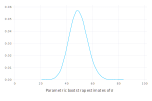
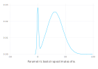
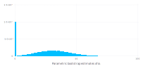
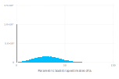

# Parametric bootstrap for linear mixed-effects models

Julia is well-suited to implementing bootstrapping and other simulation-based methods for statistical models.
The `parametricbootstrap` function in the [MixedModels package](https://github.com/dmbates/MixedModels.jl) provides
an efficient parametric bootstrap for linear mixed-effects models.

## The parametric bootstrap

[Bootstrapping](https://en.wikipedia.org/wiki/Bootstrapping_(statistics)) is a family of procedures
for generating sample values of a statistic, allowing for visualization of the distribution of the
statistic or for inference from this sample of values.

A _parametric bootstrap_ is used with a parametric model, `m`, that has been fit to data.
The procedure is to simulate `n` response vectors from `m` using the estimated parameter values
and refit `m` to these responses in turn, accumulating the statistics of interest at each iteration.

The parameters of a `LinearMixedModel` object are the fixed-effects
parameters, `β`, the standard deviation, `σ`, of the per-observation noise, and the covariance
parameter, `θ`, that defines the variance-covariance matrices of the random effects.

For example, a simple linear mixed-effects model for the `Dyestuff` data in the [`lme4`](http://github.com/lme4/lme4)
package for [`R`](https://www.r-project.org) is fit by

````julia
using DataFrames, Gadfly, MixedModels, Random, RData
testdir = normpath(joinpath(dirname(pathof(MixedModels)), "..", "test"));
const dat = Dict(Symbol(k)=>v for (k,v) in load(joinpath(testdir, "dat.rda")));
````


````julia
ds = names!(dat[:Dyestuff], [:Batch, :Yield])  # the Dyestuff data
m1 = fit!(LinearMixedModel(@formula(Yield ~ 1 + (1 | Batch)), ds))
````


````
Linear mixed model fit by maximum likelihood
 Yield ~ 1 + (1 | Batch)
   logLik   -2 logLik     AIC        BIC    
 -163.66353  327.32706  333.32706  337.53065

Variance components:
            Column    Variance  Std.Dev. 
Batch    (Intercept)  1388.3333 37.260345
Residual              2451.2500 49.510100
 Number of obs: 30; levels of grouping factors: 6

  Fixed-effects parameters:
──────────────────────────────────────────────────
             Estimate  Std.Error  z value  P(>|z|)
──────────────────────────────────────────────────
(Intercept)    1527.5    17.6946   86.326   <1e-99
──────────────────────────────────────────────────
````


To bootstrap the model parameters, we first initialize a random number generator

````julia
rng = MersenneTwister(1234321);
````


then create a bootstrap sample

````julia
samp = parametricbootstrap(rng, 100_000, m1);
DataFrame(samp.bstr)
````


````
100000×4 DataFrame
│ Row    │ objective │ σ       │ β₁      │ θ          │
│        │ Float64   │ Float64 │ Float64 │ StaticAr…  │
├────────┼───────────┼─────────┼─────────┼────────────┤
│ 1      │ 339.022   │ 67.4315 │ 1509.13 │ [0.212245] │
│ 2      │ 322.689   │ 47.9831 │ 1538.08 │ [0.53284]  │
│ 3      │ 324.002   │ 50.1346 │ 1508.02 │ [0.434076] │
│ 4      │ 331.887   │ 53.2238 │ 1538.47 │ [0.771383] │
│ 5      │ 317.771   │ 45.2975 │ 1520.62 │ [0.423428] │
│ 6      │ 315.181   │ 36.7556 │ 1536.94 │ [1.33812]  │
│ 7      │ 333.641   │ 53.8161 │ 1519.88 │ [0.867993] │
⋮
│ 99993  │ 316.391   │ 46.8395 │ 1550.0  │ [0.124962] │
│ 99994  │ 317.945   │ 44.8718 │ 1521.41 │ [0.478633] │
│ 99995  │ 325.988   │ 51.6486 │ 1555.92 │ [0.44905]  │
│ 99996  │ 326.679   │ 52.1719 │ 1551.36 │ [0.455478] │
│ 99997  │ 331.908   │ 61.1217 │ 1500.47 │ [0.0]      │
│ 99998  │ 316.566   │ 40.2188 │ 1531.02 │ [0.905006] │
│ 99999  │ 323.937   │ 51.2282 │ 1530.76 │ [0.331144] │
│ 100000 │ 315.836   │ 38.3816 │ 1544.5  │ [1.1136]   │
````


The results from the bootstrap sampling are returned as a `Table`, as defined in the `TypedTables.jl` package.
The $\theta$ column is a vector - in this case a one-dimensional vector.  The `first` and `last` functions are useful for extracting individual elements from the sampled vectors.

Notice that, for some samples, the estimated value of $\theta$ is `[0.0]`.  In fact, this is the case for about about 10% of all the samples.

````julia
sum(iszero, samp.θ)
````


````
10090
````


A density plot of the bootstrapped values of `σ` shows a slightly skewed but unimodal distribution

````julia
plot(x=samp.σ, Geom.density, Guide.xlabel("Parametric bootstrap estimates of σ"))
````





but a density plot of the bootstrap estimates of $\theta_1$, or of $\sigma_1=\theta_1 \cdot \sigma$

````julia
plot(x=first.(samp.θ), Geom.density, Guide.xlabel("Parametric bootstrap estimates of θ₁"))
````




````julia
plot(x=first.(samp.σs.Batch), Geom.density, Guide.xlabel("Parametric bootstrap estimates of σ₁"))
````





has a mode at zero.  Although this mode appears to be diffuse, this is an artifact of the way that density plots are created.  In fact, it is a pulse, as can be seen from a histogram.

````julia
plot(x=first.(samp.σs.Batch), Geom.histogram, Guide.xlabel("Parametric bootstrap estimates of σ₁"))
````



