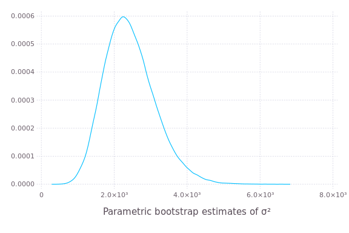
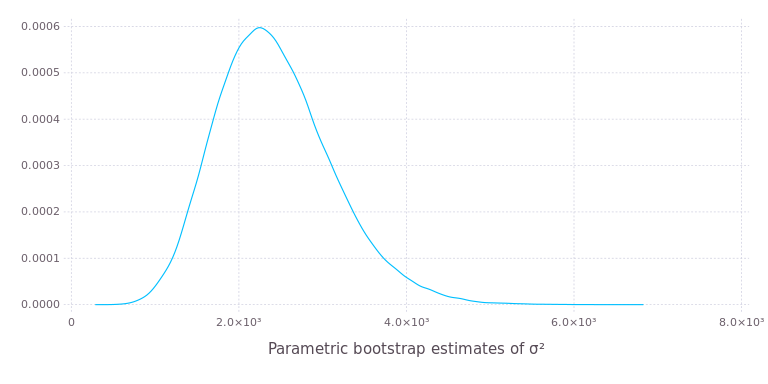

# Parametric bootstrap for linear mixed-effects models

Julia is well-suited to implementing bootstrapping and other simulation-based methods for statistical models.
The `bootstrap!` function in the [MixedModels package](https://github.com/dmbates/MixedModels.jl) provides
an efficient parametric bootstrap for linear mixed-effects models, assuming that the results of interest
from each simulated response vector can be incorporated into a vector of floating-point values.

## The parametric bootstrap

[Bootstrapping](https://en.wikipedia.org/wiki/Bootstrapping_(statistics)) is a family of procedures
for generating sample values of a statistic, allowing for visualization of the distribution of the
statistic or for inference from this sample of values.

A _parametric bootstrap_ is used with a parametric model, `m`, that has been fitted to data.
The procedure is to simulate `n` response vectors from `m` using the estimated parameter values
and refit `m` to these responses in turn, accumulating the statistics of interest at each iteration.

The parameters of a linear mixed-effects model as fit by the `lmm` function are the fixed-effects
parameters, `β`, the standard deviation, `σ`, of the per-observation noise, and the covariance
parameter, `θ`, that defines the variance-covariance matrices of the random effects.

For example, a simple linear mixed-effects model for the `Dyestuff` data in the [`lme4`](http://github.com/lme4/lme4)
package for [`R`](https://www.r-project.org) is fit by
````julia
julia> using DataFrames, Gadfly, MixedModels
````


````julia
julia> show(ds)   # Dyestuff data set30×2 DataFrames.DataFrame
│ Row │ Yield  │ Batch │
├─────┼────────┼───────┤
│ 1   │ 1545.0 │ 'A'   │
│ 2   │ 1440.0 │ 'A'   │
│ 3   │ 1440.0 │ 'A'   │
│ 4   │ 1520.0 │ 'A'   │
│ 5   │ 1580.0 │ 'A'   │
│ 6   │ 1540.0 │ 'B'   │
│ 7   │ 1555.0 │ 'B'   │
│ 8   │ 1490.0 │ 'B'   │
│ 9   │ 1560.0 │ 'B'   │
│ 10  │ 1495.0 │ 'B'   │
│ 11  │ 1595.0 │ 'C'   │
│ 12  │ 1550.0 │ 'C'   │
│ 13  │ 1605.0 │ 'C'   │
│ 14  │ 1510.0 │ 'C'   │
│ 15  │ 1560.0 │ 'C'   │
│ 16  │ 1445.0 │ 'D'   │
│ 17  │ 1440.0 │ 'D'   │
│ 18  │ 1595.0 │ 'D'   │
│ 19  │ 1465.0 │ 'D'   │
│ 20  │ 1545.0 │ 'D'   │
│ 21  │ 1595.0 │ 'E'   │
│ 22  │ 1630.0 │ 'E'   │
│ 23  │ 1515.0 │ 'E'   │
│ 24  │ 1635.0 │ 'E'   │
│ 25  │ 1625.0 │ 'E'   │
│ 26  │ 1520.0 │ 'F'   │
│ 27  │ 1455.0 │ 'F'   │
│ 28  │ 1450.0 │ 'F'   │
│ 29  │ 1480.0 │ 'F'   │
│ 30  │ 1445.0 │ 'F'   │
````


````julia
julia> m1 = fit!(lmm(Yield ~ 1 + (1 | Batch), ds))  
Linear mixed model fit by maximum likelihood
 Formula: Yield ~ 1 + (1 | Batch)
  logLik    -2 logLik     AIC        BIC    
 -163.66353  327.32706  333.32706  337.53065

Variance components:
              Column    Variance  Std.Dev. 
 Batch    (Intercept)  1388.3334 37.260346
 Residual              2451.2500 49.510100
 Number of obs: 30; levels of grouping factors: 6

  Fixed-effects parameters:
             Estimate Std.Error z value P(>|z|)
(Intercept)    1527.5   17.6946  86.326  <1e-99

````


## Using the `bootstrap!` function

This quick explanation is provided for those who only wish to use the `bootstrap!` method and do not need
detailed explanations of how it works.
The three arguments to `bootstrap!` are the matrix that will be overwritten with the results, the model to bootstrap,
and a function that overwrites a vector with the results of interest from the model.

Suppose the objective is to obtain 100,000 parametric bootstrap samples of the estimates of the "variance
components", `σ²` and `σ₁²`, in this model.  In many implementations of mixed-effects models the
estimate of `σ₁²`, the variance of the scalar random effects, is reported along with a
standard error, as if the estimator could be assumed to have a Gaussian distribution.
Is this a reasonable assumption?

A suitable function to save the results is
````julia
julia> function saveresults!(v, m)
    v[1] = varest(m)
    v[2] = abs2(getθ(m)[1]) * v[1]
end
saveresults! (generic function with 1 method)
````


The `varest` extractor function returns the estimate of `σ²`.  As seen above, the estimate of the
`σ₁` is the product of `Θ` and the estimate of `σ`.  The expression `abs2(getΘ(m)[1])` evaluates to
`Θ²`. The `[1]` is necessary because the value returned by `getθ` is a vector and a scalar is needed
here.

As with any simulation-based method, it is advisable to set the random number seed before calling
`bootstrap!` for reproducibility.
````julia
julia> srand(1234321);
MersenneTwister(Base.dSFMT.DSFMT_state(Int32[-1066020669,1073631810,397127531,1072701603,-312796895,1073626997,1020815149,1073320576,650048908,1073512247  …  -352178910,1073735534,1816227101,1072823316,-1468787611,-2121692099,358864500,-310934288,382,0]),[1.09857,1.52278,1.29205,1.58248,1.76821,1.12729,1.91324,1.13434,1.86838,1.19769  …  1.91228,1.82615,1.801,1.58645,1.48315,1.6551,1.08701,1.22284,1.42061,1.41889],382,UInt32[0x0012d591])
````


````julia
julia> results = bootstrap!(zeros(2, 100000), m1, saveresults!);
2x100000 Array{Float64,2}:
 4547.01   2302.38   2513.48   2832.77  2051.86   …  2721.9    3735.86  1617.55  2624.33   1473.15
  204.834   653.688   473.595  1685.59   367.881      564.686     0.0   1324.83   287.775  1826.86
````








The distribution of the bootstrap samples of `σ²` is a bit skewed but not terribly so.  However, the
distribution of the bootstrap samples of the estimate of `σ₁²` is highly skewed and has a spike at
zero.
